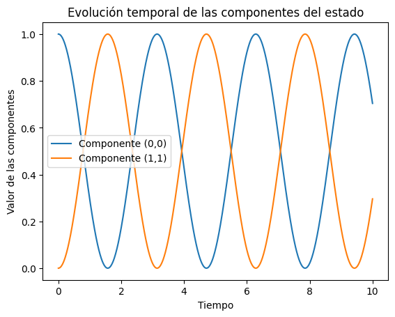

# Tutorial: Paso a paso sobre cómo utilizar las funciones `dyn_generator` & `rk4`

Buscamos resolver para la función:

\[
f(t, \mathbf{y}) = -{\rm{i}} [\mathbf{O}, \mathbf{y}(t)],
\]

Donde tenemos la matriz `O`, que es un operador lineal que actúa sobre la matriz `y` que describe la evolución temporal del sistema.

## Definición de las matrices iniciales

Primero, definimos ambas matrices necesarias para el problema: `linear_operation`, que es la matriz del operador, y `initial_state`, que es el estado inicial del sistema.

```py
import numpy as np

# Definimos la matriz operador lineal O
linear_operation = np.array([[0, 1], [1, 0]])

# Definimos el estado inicial de la matriz y
initial_state = np.array([[0, 0], [0, 1]])
``` 

## Definición de los tiempos de evolución:
Luego, creamos una discretización temporal y las matrices donde se guardarán los valores de las componentes 00 y 11 del estado durante la evolución:

``` py
# Creamos un arreglo de tiempos con una separación uniforme
times = np.linspace(0.0, 10.0, 1011)

# Calculamos el paso temporal h
h = times[1] - times[0]

# Inicializamos los arrays donde guardaremos la evolución de las componentes (0,0) y (1,1)
stateQuant00 = np.zeros(times.size)
stateQuant11 = np.zeros(times.size)

# Generamos una copia de la matriz de estado inicial
yCopy = initial_state.copy()
``` 
## Evolución temporal utilizando `rk4` y `dyn_generator`:

En este paso, utilizamos las funciones dadas. Primero, generamos la función \( f(t, \mathbf{y}) \) usando `dyn_generator`, que representa la dinámica del sistema. Luego, aplicamos el método de integración de Runge-Kutta de cuarto orden (rk4) para avanzar en el tiempo:

``` py
# Iteramos sobre todos los tiempos en el array
for tt in range(times.size):

    # Guardamos los valores de las componentes (0,0) y (1,1) del estado en cada paso
    stateQuant00[tt] = yCopy[0, 0].real
    stateQuant11[tt] = yCopy[1, 1].real

    # Calculamos el siguiente estado usando el método RK4
    yN = rk4(dyn_generator, linear_operation, yCopy, h)

    # Actualizamos el estado inicial para la siguiente iteración
    yCopy = yN
```
## Visualización de resultados:

Finalmente, graficamos los resultados para observar cómo evolucionan las componentes (0,0) y (1,1) del estado a lo largo del tiempo. Usamos `matplotlib` para visualizar estos datos:

``` py
import matplotlib.pyplot as plt

# Generamos el gráfico de la componente (0,0)
plt.plot(times, stateQuant00, label="Componente (0,0)")

# Generamos el gráfico de la componente (1,1)
plt.plot(times, stateQuant11, label="Componente (1,1)")

# Añadimos título y etiquetas
plt.title("Evolución temporal de las componentes del estado")
plt.xlabel("Tiempo")
plt.ylabel("Valor de las componentes")
plt.legend()

# Mostramos el gráfico
plt.show()
``` 
